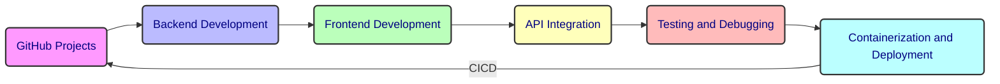

# [GiftLink - IBM JS Developer Full Stack Capstone Project](https://www.coursera.org/learn/javascript-full-stack-capstone-project/home/info)

Get project performance metrics on [GitHub Insights](https://github.com/watashiaashishgurung/IBM-fullstack-capstone-project/graphs/traffic) and track the project's progress on the [GiftLink Kanban Board](https://github.com/users/watashiaashishgurung/projects/14).

## Project Overview
[GiftLink](https://github.com/ibm-developer-skills-network/tqqej-fullstack-capstone-template) is a full-stack web application designed to connect users who wish to give away household items they no longer need with users who enjoy recycling and prefer finding free household items that match their tastes rather than purchasing new ones.


## Architecture & Directory Structure
The GiftLink application follows a **structured directory architecture**, ensuring modularity and scalability.

```
📂 fullstack-capstone-project
 ┣ 📂 github
 ┣ 📂 giftlink-backend (Express Backend)
 ┣ 📂 giftlink-frontend (React Frontend)
 ┣ 📂 sentiment (Sentiment Analysis Services)
 ┣ 📜 README.md (Project Documentation)
 
```

## **Project Description**

| Feature                    | Description                        | Software Used |
|----------------------------|------------------------------------|---------------|
| **Project Setup**          | Clone repository, set up structure, create Kanban board, set up MongoDB. | GitHub, MongoDB |
| **Home Page**              | The main landing page of the app.  | React, HTML, CSS |
| **Listings Page**          | Displays all available items.      | React, HTML, CSS |
| **Navigation Bar**         | Provides easy navigation links.    | React, HTML, CSS |
| **Search Function**        | Allows users to search for items.  | React, HTML, CSS |
| **Item Details Page**      | Shows detailed information of an item. | React, HTML, CSS |
| **Registration & Login Pages** | Enables user authentication. | React, HTML, CSS, JWT |
| **Editable Profile Page**  | Allows users to edit their profiles. | React, HTML, CSS |
| **Backend API Development**| Implement API endpoints, search function, sentiment analysis. | Node.js, Express, MongoDB |
| **Front-end Development**  | Build React components for various pages and functionalities. | React, HTML, CSS |
| **Authentication & User Management** | Implement JWT authentication, user profile functionality. | JWT, React, Node.js |
| **Containerization & Deployment** | Containerize with Docker, deploy using Kubernetes & IBM Code Engine, implement CI/CD. | Docker, Kubernetes, IBM Code Engine, GitHub Actions |
| **Peer Review & Final Submission** | Submit for peer review, complete final readings and assessments. | 100% |


## Project Modules 
| Module | Description |
|--------|-------------|
| **Module 1 - Project Setup** | Clone the repository and set up the project structure. Create a **Kanban board** with user stories to track progress. Set up **MongoDB** for data storage. |
| **Module 2 - Backend API Development** | Implement API endpoints for **listing resources**. Develop a search function with **multiple parameters**. Implement **sentiment analysis** for user comments. |
| **Module 3 - Front-end Development** | Build React components for: Home Page, Navigation Bar, Login & Registration Pages, Item Listings & Details Page, Search Functionality. |
| **Module 4 - Authentication & User Management** | Implement user **registration & login** using **JWT authentication**. Develop a **user profile** functionality. |
| **Module 5 - Containerization & Deployment** | Containerize the application using **Docker**. Deploy using **Kubernetes & IBM Code Engine**. Implement **CI/CD pipeline** with GitHub Actions. |
| **Module 6 - Peer Review & Final Submission** | Submit the project for **peer review**. Wrap up the course with final readings and assessments. |
---
### Fullstack Capstone Project File-structure

<details>
  <summary>.github</summary>
    
- **ISSUE_TEMPLATE/**
  - `custom.md`
  - **workflows/**
  - `main`
</details>
<details>
  <summary>giftlink-backend</summary>

  - **models/**
    - `db.js`
  - **routes/**
    - `authRoutes.js`
    - `giftRoutes.js`
    - `searchRoutes.js`
  - **util/**
  - **import-mongo/**
    - `.env`
    - `.env.sample`
    - `gifts.json`
    - `index.js`
    - `package-lock.json`
    - `package.json`
  - `.env`
  - `.env.sample`
  - `app.js`
  - `deployment.yml`
  - `Dockerfile`
  - `logger.js`
  - `package-lock.json`
  - `package.json`
</details>

<details>
  <summary>giftlink-frontend</summary>

  - **Dockerfile/**

  - **node_modules/**
  - **public/**
    - **images/**
    - **static/**
  - **src/**
    - **components/**
      - **DetailsPage/**
        - `DetailsPage.css`
        - `DetailsPage.js`
      - **LandingPage/**
        - `LandingPage.css`
        - `LandingPage.js`
      - **LoginPage/**
        - `LoginPage.css`
        - `LoginPage.js`
      - **MainPage/**
        - `MainPage.js`
      - **Navbar/**
        - `Navbar.js`
      - **ProductDetailsPage/**
        - `ProductDetailsPage.js`
      - **Profile/**
        - `Profile.css`
        - `Profile.js`
      - **RegisterPage/**
        - `RegisterPage.css`
        - `RegisterPage.js`
      - **SearchPage/**
        - `SearchPage.css`
        - `SearchPage.js`
    - **context/**
      - `AuthContext.js`
    - `App.css`
    - `App.js`
    - `config.js`
    - `index.css`
    - `index.js`
   </details>

<details>
  <summary>sentiment</summary>
  
- **`index.js`/**
- **`package-lock.json`/**
- **`package.json`/**
   </details>

<details>
  <summary> LICENSE</summary>

- [`LICENSE`](./LICENSE)
   </details>

<details>
    <summary>README.md</summary>

- [`README.md`](./README.md)
   </details>

-----------------
This project is licensed under the [` Apache License`](./LICENSE)
-----------------

🔗 [GiftLink GitHub Repository](https://github.com/watashiaashishgurung/fullstack-capstone-project.git)
-----------------------------------------------------------
Note! Database deploment file is not included. For more information feel free to contact me. Succes!
